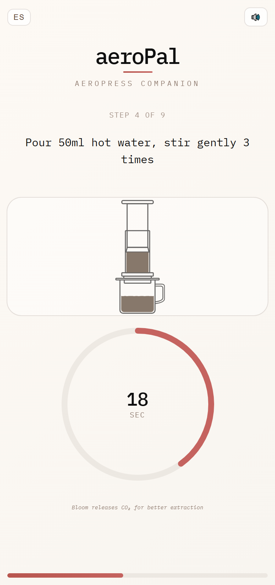

# AeroPal ☕

**Your intelligent AeroPress brewing companion**

AeroPal is a sleek, step-by-step brewing guide for AeroPress coffee makers. Built with React, it provides precise timing, multiple brewing recipes, and an intuitive interface to help you craft the perfect cup every time.



## ✨ Features

- **4 Brewing Recipes**: Classic, Strong, Light, and Iced coffee profiles
- **Step-by-Step Guidance**: Clear instructions with visual progress tracking
- **Smart Timers**: Automated timing for bloom, steep, and press phases
- **Audio Feedback**: Optional sound notifications for timer completion
- **Bilingual Support**: Available in English and Spanish
- **Responsive Design**: Works seamlessly on mobile and desktop
- **Beautiful UI**: Clean, coffee-shop inspired design with smooth animations

## 🚀 Quick Start

### Prerequisites

- Node.js 16+
- npm, pnpm or yarn

### Installation

```bash
# Clone the repository
git clone https://github.com/DiegoVallejoDev/aeropal.git

# Navigate to project directory
cd aeropal

# Install dependencies
pnpm install

# Start development server
pnpm start
```

The app will be available at `http://localhost:3000`

## 📱 Usage

1. **Select Your Recipe**: Choose from Classic, Strong, Light, or Iced brewing profiles
2. **Start Brewing**: Follow the step-by-step instructions
3. **Timer Guidance**: Let AeroPal handle the timing for bloom and steep phases
4. **Perfect Cup**: Enjoy your expertly crafted AeroPress coffee

### Recipe Profiles

| Recipe      | Coffee | Water | Ratio  | Brew Time            |
| ----------- | ------ | ----- | ------ | -------------------- |
| **Classic** | 17g    | 250ml | 1:15   | Balanced & smooth    |
| **Strong**  | 20g    | 250ml | 1:12.5 | Bold & rich          |
| **Light**   | 15g    | 250ml | 1:17   | Bright & clean       |
| **Iced**    | 22g    | 200ml | 1:9    | Concentrated for ice |

## 🛠️ Technical Details

### Built With

- **React 18** - UI framework
- **CSS-in-JS** - Styled with inline styles for component isolation
- **Web Audio API** - For timer sound notifications
- **Modern JavaScript** - ES6+ features with hooks

### Key Components

- **Timer System**: Precise countdown with visual progress indicators
- **State Management**: React hooks for brewing state and user preferences
- **Responsive Design**: Mobile-first approach with CSS Grid and Flexbox
- **Accessibility**: Keyboard navigation and screen reader support

## 🎨 Design System

AeroPal uses a carefully crafted design system inspired by coffee culture:

- **Colors**: Warm creams, rich browns, and accent reds
- **Typography**: IBM Plex Mono for a modern, technical feel
- **Animations**: Smooth transitions and micro-interactions
- **Layout**: Clean, centered design with generous whitespace

## 🌐 Internationalization

Currently supports:

- 🇺🇸 English
- 🇲🇽 Spanish (Español)

To add a new language:

1. Create a new translation file in `src/translations/`
2. Add the language option to the language switcher
3. Update the `translations` object in the main component

## 🚀 Deployment

### Build for Production

```bash
pnpm run dev
```

### Deploy to GitHub Pages

```bash
pnpm run deploy
```

### Deploy to Vercel

```bash
vercel --prod
```

### Deploy to Netlify

```bash
netlify deploy --prod --dir=build
```

## 🤝 Contributing

We welcome contributions! Please see our [Contributing Guide](CONTRIBUTING.md) for details.

### Development Workflow

1. Fork the repository
2. Create a feature branch (`git checkout -b feature/amazing-feature`)
3. Commit your changes (`git commit -m 'Add amazing feature'`)
4. Push to the branch (`git push origin feature/amazing-feature`)
5. Open a Pull Request

### Code Style

- Use ESLint and Prettier for code formatting
- Follow React best practices and hooks patterns
- Write meaningful commit messages
- Add tests for new features

## 📋 Roadmap

- [ ] **Lottie Animations**: Rich brewing animations
- [ ] **Custom Recipes**: User-defined brewing profiles
- [ ] **Brew History**: Track and rate your brews
- [ ] **Export Recipes**: Share recipes with friends
- [ ] **PWA Support**: Offline functionality
- [ ] **More Languages**: French, German, Japanese
- [ ] **Smart Notifications**: Push notifications for timing
- [ ] **Brew Journal**: Notes and improvements tracking

## 🐛 Known Issues

- Audio may not work on some mobile browsers due to autoplay policies
- Timer precision may vary slightly across different devices
- Some animations may be reduced on low-performance devices

## 📄 License

This project is licensed under the MIT License - see the [LICENSE](LICENSE) file for details.

## 🙏 Acknowledgments

- **AeroPress Inc.** - For creating the amazing brewing method
- **Coffee Community** - For recipe inspiration and feedback
- **React Team** - For the excellent framework
- **Contributors** - Everyone who helped make AeroPal better

## 📞 Support

- 🐛 Issues: [GitHub Issues](https://github.com/DiegoVallejoDev/aeropal/issues)
- 💬 Discussions: [GitHub Discussions](https://github.com/DiegoVallejoDev/aeropal/discussions)

---

**Made with ☕ and ❤️ by Diego Vallejo **

_Brew better coffee, one step at a time._
