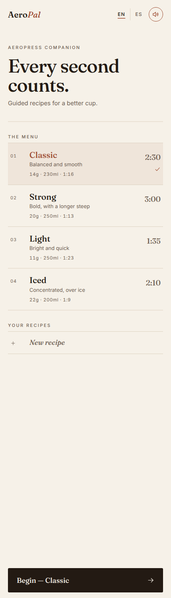

# AeroPal ☕

**Your intelligent AeroPress brewing companion**

AeroPal is a sleek, step-by-step brewing guide for AeroPress coffee makers. Built with React, it provides precise timing, multiple brewing recipes, and an intuitive interface to help you craft the perfect cup every time.



## ✨ Features

### Core Brewing Features

- **4 Built-in Recipes**: Classic, Strong, Light, and Iced coffee profiles
- **Custom Recipe Creator**: Design and save your own brewing methods
- **Flexible Step System**: Support for instruction, timer, automatic, and completion steps
- **Smart Timers**: Automated timing with visual countdown and audio feedback
- **Step-by-Step Guidance**: Clear instructions with visual progress tracking

### Customization & Personalization

- **Recipe Editor**: Full-featured interface for creating custom recipes
- **Multiple Step Types**:
  - **Instruction Steps**: Manual actions with custom button text
  - **Timer Steps**: Automated countdown with customizable duration
  - **Automatic Steps**: Self-advancing steps with delay
  - **Completion Steps**: Custom celebration screens
- **Recipe Management**: Save, edit, and delete custom recipes
- **Persistent Storage**: All custom recipes saved locally

### User Experience

- **Bilingual Support**: Complete interface in English and Spanish
- **Responsive Design**: Works seamlessly on mobile, tablet, and desktop
- **Audio Feedback**: Optional sound notifications with a soft two-tone chime
- **Barista Mode**: The brew screen drops into a dark, low-glare room with a smooth sweeping timer ring
- **Editorial Design**: Menu-style recipe list, Fraunces serif display type, hairline rules
- **Modular Architecture**: Clean, maintainable codebase with TypeScript

## 🚀 Quick Start

### Prerequisites

- Node.js 16+
- npm, pnpm or yarn

### Installation

```bash
# Clone the repository
git clone https://github.com/DiegoVallejoDev/aeropal.git

# Navigate to project directory
cd aeropal

# Install dependencies
pnpm install

# Start development server
pnpm run dev
```

The app will be available at `http://localhost:3000`

## 📱 Usage

### Basic Brewing

1. **Select Your Recipe**: Choose from built-in recipes or your custom creations
2. **Start Brewing**: Follow the step-by-step instructions
3. **Timer Guidance**: Let AeroPal handle automatic timing and notifications
4. **Perfect Cup**: Enjoy your expertly crafted AeroPress coffee

### Creating Custom Recipes

1. **Click "Create Recipe"**: Access the recipe editor from the home screen
2. **Set Basic Parameters**: Configure coffee amount, water volume, and description
3. **Design Custom Steps**: Add instruction, timer, automatic, or completion steps
4. **Save & Brew**: Your custom recipe appears on the home screen ready to use

### Step Types

- **Instruction**: Manual steps with custom button text and tips
- **Timer**: Automated countdown with duration control and audio alerts
- **Automatic**: Self-advancing steps with customizable delays
- **Completion**: Custom celebration screens with icons and messages

### Recipe Profiles

| Recipe      | Coffee | Water | Ratio  | Brew Time            |
| ----------- | ------ | ----- | ------ | -------------------- |
| **Classic** | 14g    | 230ml | 1:16.4 | Balanced & smooth    |
| **Strong**  | 20g    | 250ml | 1:12.5 | Bold & rich          |
| **Light**   | 11g    | 250ml | 1:17   | Bright & clean       |
| **Iced**    | 22g    | 200ml | 1:9    | Concentrated for ice |

## 🛠️ Technical Details

### Built With

- **React 18** - UI framework with hooks and modern patterns
- **TypeScript** - Type-safe development with comprehensive interfaces
- **CSS3** - Modern styling with CSS Grid, Flexbox, and animations
- **Web Audio API** - For timer sound notifications
- **LocalStorage API** - Persistent recipe storage
- **Wake Lock API** - Keeps the screen awake while brewing
- **vite-plugin-pwa** - Installable, offline-capable

### Architecture & Components

- **Modular Design**: Separated components, hooks, data, and lib utilities
- **Custom Hooks**: `useCountdown`, `useSound`, `useRecipes`, `useLanguage`, `useWakeLock`
- **Drift-Free Timing**: `requestAnimationFrame` + `performance.now()` countdown
- **Recipe Management**: Full CRUD operations with validated local persistence
- **Type Safety**: Comprehensive TypeScript interfaces and types
- **Zero Icon/Animation Dependencies**: Inline SVG icon set, CSS-only motion

## 🎨 Design System

AeroPal uses an editorial design system inspired by café menus and coffee print culture:

- **Colors**: Warm paper and espresso ink, with a single burnt-sienna accent; the brew screen inverts to a dark, low-glare room
- **Typography**: Fraunces for display, Inter for interface, tabular numerals for the timer
- **Details**: Hairline rules, uppercase micro-labels, restrained motion
- **Layout**: A single centered column that reads like a menu

## 🌐 Internationalization

Currently supports:

- 🇺🇸 English
- 🇲🇽 Spanish (Español)

To add a new language:

1. Create a new translation file in `src/translations/`
2. Add the language option to the language switcher
3. Update the `translations` object in the main component

## 🚀 Deployment

### Build for Production

```bash
pnpm run dev
```

### Deploy to GitHub Pages

```bash
pnpm run deploy
```

### Deploy to Vercel

```bash
vercel --prod
```

### Deploy to Netlify

```bash
netlify deploy --prod --dir=build
```

## 🤝 Contributing

We welcome contributions! Please see our [Contributing Guide](CONTRIBUTING.md) for details.

### Development Workflow

1. Fork the repository
2. Create a feature branch (`git checkout -b feature/amazing-feature`)
3. Commit your changes (`git commit -m 'Add amazing feature'`)
4. Push to the branch (`git push origin feature/amazing-feature`)
5. Open a Pull Request

### Code Style

- Use ESLint and Prettier for code formatting
- Follow React best practices and hooks patterns
- Write meaningful commit messages
- Add tests for new features

## 📋 Roadmap

### ✅ Recently Added

- [x] **Custom Recipes**: User-defined brewing profiles with full editor
- [x] **Flexible Step System**: Multiple step types (instruction, timer, automatic, completion)
- [x] **Recipe Management**: Save, edit, delete custom recipes
- [x] **Modular Architecture**: Clean, maintainable TypeScript codebase
- [x] **Enhanced Timer System**: Fixed timing with proper state management

### 🔮 Future Features

- [ ] **Recipe Import/Export**: Share recipes with JSON files
- [ ] **Brew History**: Track and rate your brewing sessions
- [ ] **Recipe Templates**: Pre-built templates for common brewing styles
- [ ] **Advanced Timers**: Multiple concurrent timers for complex recipes
- [ ] **PWA Support**: Offline functionality and app installation
- [ ] **More Languages**: French, German, Japanese, Italian
- [ ] **Smart Notifications**: Push notifications for timing reminders
- [ ] **Brew Journal**: Notes, improvements, and tasting notes
- [ ] **Recipe Community**: Share and discover recipes online

## 🐛 Known Issues

- Audio may not work on some mobile browsers due to autoplay policies
- Timer precision may vary slightly across different devices
- Some animations may be reduced on low-performance devices

## 📄 License

This project is licensed under the MIT License - see the [LICENSE](LICENSE) file for details.

## 🙏 Acknowledgments

- **AeroPress Inc.** - For creating the amazing brewing method
- **Coffee Community** - For recipe inspiration and feedback
- **React Team** - For the excellent framework
- **Contributors** - Everyone who helped make AeroPal better

## 📞 Support

- 🐛 Issues: [GitHub Issues](https://github.com/DiegoVallejoDev/aeropal/issues)
- 💬 Discussions: [GitHub Discussions](https://github.com/DiegoVallejoDev/aeropal/discussions)

---

**Made with ☕ and ❤️ by Diego Vallejo **

_Brew better coffee, one step at a time._
